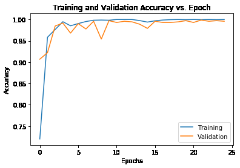
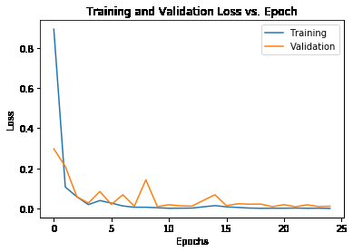
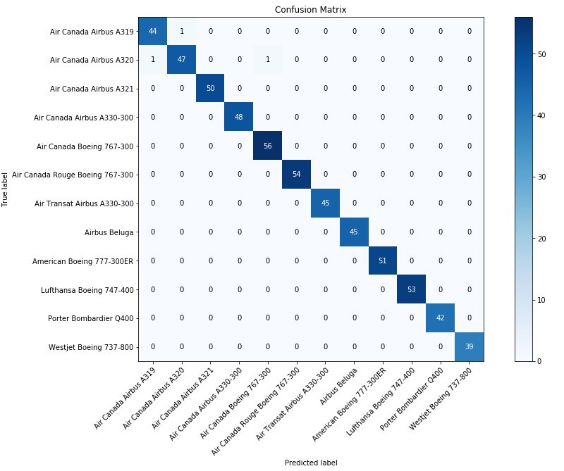

# AER202

## Overview

AER202 is a tool that uses machine learning to automatically identify planes 
from a photo. The goal is to assist plane-spotters by identifying subtle 
airplane characteristics that might be otherwise difficult to spot by eye. 
Applying neural networks to this problem could greatly increase the 
identification accuracy and speed. 

Currently the tool is trained on:
- Air Canada Airbus A319
- Air Canada Airbus A320
- Air Canada Airbus A321
- Air Canada Airbus A330-300
- Air Canada Boeing 767-300
- Air Canada Rouge Boeing 767-300
- Westjet Boeing 737-800
- Air Transat Airbus A330-300
- Airbus Beluga Transporter
- Lufthansa Boeing 747-400
- Porter Bombardier Q400
- American Boeing 777-300ER

## Data Collection
We created a web scraper using `BeautifulSoup` to scrape airliners.net. We then manually went through ~3600 photos to remove low quality ones. A photo was deemed low quality if it was taken at night, in bad weather, from the interior, or at angles where it would be nearly impossible to make out differentiating features (e.g. front, back).

## Model
We used transfer learning with ResNet152 (pre-trained model) and a final fully connected layer. Since ResNet152 was pre-trained, this significantly reduced the time to train and allowed us to use it as a feature extractor. The output from this was fed into a fully connected layer to map these features to specific planes.

Additional strategies we used to improve our accuracies were:
- Using an adaptive learning rate
- Increasing the resolution of our dataset
- Intelligently cropping photos using YOLO object detection to remove unnecessary background information
- Applying data augmentation

Final accuracies:

|  Dataset   | Value  |
| :--------: | :----: |
|  Training  |  100%  |
| Validation | 99.58% |
|  Testing   | 99.83% |

## Limitations
Although we have very high accuracies, the model is only able to reliably identify planes from photos that are taken in ideal conditions (i.e. daytime, clear weather, side profile). Additionally, it is limited to identifying a relatively small number of planes.
